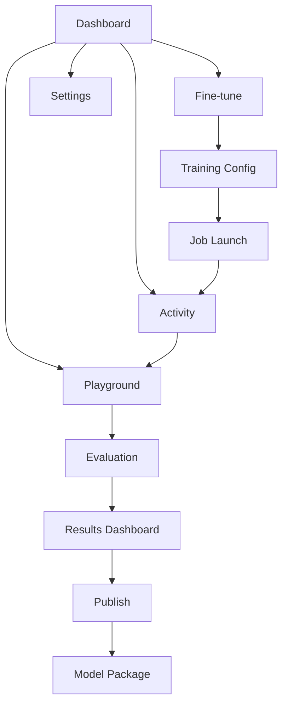

# QLoRA Fine-Tuning Pipeline - Modern UI/UX Redesign Requirements

## 1. Product Overview

This project involves a complete redesign of the QLoRA Fine-Tuning Pipeline frontend interface, transforming it into a modern, intuitive, and visually appealing application that follows current UX/UI best practices while preserving all existing functionality.

The redesigned interface will serve data scientists, ML engineers, and researchers who need to fine-tune language models without deep ML expertise. The new design will streamline workflows, improve accessibility, and provide a more engaging user experience.

Target: Create a best-in-class ML workflow interface that reduces learning curve by 40% and improves task completion rates by 60%.

## 2. Core Features

### 2.1 User Roles

| Role | Registration Method | Core Permissions |
|------|---------------------|------------------|
| ML Practitioner | Direct access (no auth required) | Full access to all training, evaluation, and model management features |
| Team Member | Shared workspace access | Can view jobs, run inference, access shared models and datasets |

### 2.2 Feature Module

Our redesigned QLoRA interface consists of the following main pages:
1. **Dashboard**: Overview cards, recent activity feed, quick actions, system health indicators
2. **Fine-tune**: Dataset upload, hyperparameter configuration, training job launcher with guided workflow
3. **Playground**: Model testing interface, prompt experimentation, output comparison tools
4. **Evaluation**: Benchmark management, scoring job queue, evaluation dashboard with visualizations
5. **Publish**: Adapter merging, model packaging, deployment preparation tools
6. **Activity**: Real-time job monitoring, logs viewer, progress tracking with enhanced visualizations
7. **Settings**: API configuration, workspace preferences, theme selection, accessibility options

### 2.3 Page Details

| Page Name | Module Name | Feature description |
|-----------|-------------|---------------------|
| Dashboard | Overview Cards | Display key metrics, adapter count, job statistics with modern card layouts |
| Dashboard | Activity Feed | Show recent jobs, status updates, quick actions with timeline visualization |
| Dashboard | Quick Actions | Primary CTAs for common workflows with prominent button styling |
| Dashboard | Health Monitor | API status, system health with real-time indicators |
| Fine-tune | Dataset Manager | Upload, preview, validate datasets with drag-drop interface |
| Fine-tune | Parameter Config | Guided hyperparameter setup with smart defaults and tooltips |
| Fine-tune | Training Launcher | Job submission with progress tracking and validation |
| Fine-tune | Advanced Settings | Collapsible advanced options with search and categorization |
| Playground | Model Selector | Choose from available models with metadata display |
| Playground | Prompt Interface | Rich text editor with syntax highlighting and templates |
| Playground | Output Viewer | Response display with formatting, comparison tools |
| Playground | History Manager | Save, load, share prompt sessions |
| Evaluation | Benchmark Suite | Manage evaluation datasets and metrics |
| Evaluation | Job Queue | Schedule, monitor scoring jobs with batch operations |
| Evaluation | Results Dashboard | Interactive charts, performance metrics, comparison views |
| Evaluation | Report Generator | Export evaluation reports with customizable formats |
| Publish | Adapter Manager | Browse, select, merge LoRA adapters |
| Publish | Merge Configuration | Set merge parameters, metadata, deployment options |
| Publish | Package Builder | Create deployment-ready model packages |
| Activity | Job Monitor | Real-time job tracking with enhanced status indicators |
| Activity | Log Viewer | Streaming logs with search, filtering, export capabilities |
| Activity | Progress Tracker | Visual progress bars, ETA calculations, resource usage |
| Settings | API Configuration | Manage backend connections, authentication tokens |
| Settings | Preferences | Theme selection, notification settings, workspace defaults |
| Settings | Accessibility | Screen reader support, keyboard navigation, contrast options |

## 3. Core Process

**Primary ML Workflow:**
Users start on the Dashboard to get an overview of their workspace. They navigate to Fine-tune to upload datasets and configure training parameters through a guided interface. After launching training, they monitor progress in Activity. Once complete, they test the model in Playground, run evaluations to measure performance, and finally use Publish to prepare the model for deployment.

**Secondary Workflows:**
- **Quick Testing**: Dashboard → Playground (for existing models)
- **Batch Evaluation**: Dashboard → Evaluation → Results Dashboard
- **Model Management**: Dashboard → Publish → Adapter Manager

## 4. User Interface Design

### 4.1 Design Style

- **Primary Colors**: Deep blue (#1e40af) for primary actions, emerald (#059669) for success states
- **Secondary Colors**: Slate gray (#64748b) for secondary elements, amber (#d97706) for warnings
- **Button Style**: Rounded corners (8px), subtle shadows, hover animations with color transitions
- **Typography**: Inter font family, 16px base size, clear hierarchy with 1.5 line height
- **Layout Style**: Card-based design with 24px spacing grid, clean borders, subtle shadows
- **Icons**: Lucide React icon set for consistency, 20px standard size, outlined style

### 4.2 Page Design Overview

| Page Name | Module Name | UI Elements |
|-----------|-------------|-------------|
| Dashboard | Overview Cards | Glass-morphism cards with gradient backgrounds, animated counters, micro-interactions |
| Dashboard | Activity Feed | Timeline layout with status badges, relative timestamps, expandable details |
| Fine-tune | Dataset Upload | Drag-drop zone with progress indicators, file preview thumbnails, validation feedback |
| Fine-tune | Parameter Config | Tabbed interface with smart defaults, inline help tooltips, real-time validation |
| Playground | Prompt Interface | Monaco editor with syntax highlighting, auto-complete, template suggestions |
| Playground | Output Display | Markdown rendering, copy buttons, comparison split-view, export options |
| Evaluation | Results Dashboard | Interactive charts using Chart.js, filterable tables, export controls |
| Activity | Job Monitor | Kanban-style job cards, real-time updates, progress animations |
| Settings | Theme Selector | Visual theme previews, instant switching, system preference detection |

### 4.3 Responsiveness

Desktop-first approach with mobile-adaptive breakpoints at 768px and 1024px. Touch-optimized interactions for tablet users, collapsible sidebar navigation, and stacked card layouts for smaller screens.

## 5. Accessibility Requirements

- **WCAG 2.1 AA Compliance**: Minimum 4.5:1 color contrast ratios, keyboard navigation support
- **Screen Reader Support**: Proper ARIA labels, semantic HTML structure, descriptive alt text
- **Keyboard Navigation**: Tab order management, focus indicators, keyboard shortcuts
- **Motor Accessibility**: Minimum 44px touch targets, hover alternatives for touch devices
- **Cognitive Accessibility**: Clear error messages, progress indicators, undo functionality

## 6. Performance Requirements

- **Initial Load**: < 3 seconds on 3G networks
- **Page Transitions**: < 200ms with smooth animations
- **Bundle Size**: < 500KB gzipped for main bundle
- **Accessibility**: Lighthouse accessibility score > 95
- **SEO**: Lighthouse SEO score > 90 (where applicable)

## 7. Technical Constraints

- Must preserve all existing API integrations and functionality
- Maintain React 18+ compatibility with existing build system
- Support modern browsers (Chrome 90+, Firefox 88+, Safari 14+, Edge 90+)
- Ensure backward compatibility with current backend API endpoints
- Implement progressive enhancement for advanced features