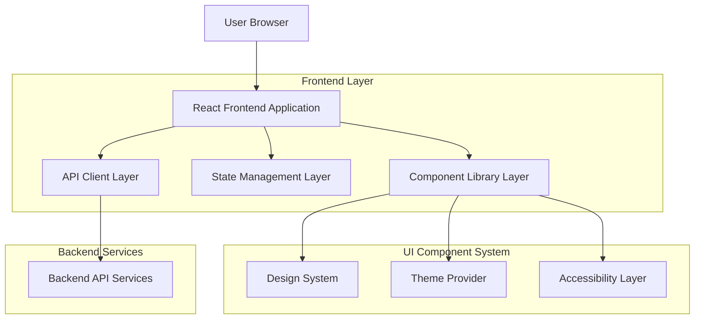

# QLoRA Fine-Tuning Pipeline - Modern UI Technical Architecture

## 1. Architecture Design



## 2. Technology Description

* Frontend: React\@18 + TypeScript\@5 + Vite\@5

* UI Library: Chakra UI\@2 + Framer Motion\@10

* State Management: Zustand\@4 + React Query\@5

* Styling: Emotion\@11 + CSS-in-JS

* Charts: Chart.js\@4 + React-Chartjs-2\@5

* Icons: Lucide React\@0.263

* Code Editor: Monaco Editor\@0.44

* Build Tool: Vite\@5 with TypeScript support

## 3. Route Definitions

| Route               | Purpose                                                              |
| ------------------- | -------------------------------------------------------------------- |
| /                   | Dashboard page with overview cards, activity feed, and quick actions |
| /train              | Fine-tuning page with dataset upload and parameter configuration     |
| /playground         | Model testing interface with prompt experimentation                  |
| /evaluate           | Evaluation management with job queue and results                     |
| /evaluate/dashboard | Interactive evaluation dashboard with charts and metrics             |
| /publish            | Model publishing and adapter merging interface                       |
| /activity           | Real-time job monitoring and log viewing                             |
| /settings           | Application settings, themes, and preferences                        |

## 4. Component Architecture

### 4.1 Design System Structure

```typescript
// Core theme configuration
interface ThemeConfig {
  colors: {
    primary: string;
    secondary: string;
    success: string;
    warning: string;
    error: string;
    background: string;
    surface: string;
  };
  typography: {
    fontFamily: string;
    fontSize: Record<string, string>;
    fontWeight: Record<string, number>;
  };
  spacing: Record<string, string>;
  borderRadius: Record<string, string>;
  shadows: Record<string, string>;
}

// Component props interface
interface ComponentProps {
  variant?: 'primary' | 'secondary' | 'ghost';
  size?: 'sm' | 'md' | 'lg';
  isLoading?: boolean;
  isDisabled?: boolean;
}
```

### 4.2 State Management Pattern

```typescript
// Global state stores
interface AppStore {
  theme: 'light' | 'dark' | 'system';
  apiStatus: 'online' | 'offline' | 'checking';
  notifications: Notification[];
  user: UserProfile | null;
}

interface JobStore {
  jobs: Job[];
  activeJob: Job | null;
  logs: LogEntry[];
  filters: JobFilters;
}

interface ModelStore {
  adapters: Adapter[];
  selectedModel: string;
  trainingParams: TrainingParameters;
}
```

## 5. Server Architecture Diagram

```mermaid
graph TD
    A[React Frontend] --> B[API Client Layer]
    B --> C[HTTP Client (Axios)]
    C --> D[Backend API]
    
    subgraph "Frontend Architecture"
        E[Component Layer]
        F[Hook Layer]
        G[Store Layer]
        H[Service Layer]
        
        E --> F
        F --> G
        G --> H
        H --> B
    end
    
    subgraph "Data Flow"
        I[UI Events]
        J[State Updates]
        K[API Calls]
        L[Cache Updates]
        
        I --> J
        J --> K
        K --> L
    end
```

## 6. Data Models

### 6.1 Core Data Interfaces

```typescript
// Job management
interface Job {
  id: string;
  kind: 'training' | 'evaluation' | 'merge' | 'inference';
  status: 'pending' | 'running' | 'completed' | 'failed';
  progress: number;
  createdAt: string;
  updatedAt: string;
  parameters: Record<string, any>;
  logs: LogEntry[];
}

// Model and adapter management
interface Adapter {
  id: string;
  name: string;
  path: string;
  description?: string;
  trainingDate?: string;
  baseModel: string;
  metrics?: EvaluationMetrics;
}

// Training configuration
interface TrainingParameters {
  modelName: string;
  datasetPath: string;
  outputDir: string;
  numTrainEpochs: number;
  learningRate: number;
  batchSize: number;
  gradientAccumulation: number;
  loraRank: number;
  loraAlpha: number;
}

// Evaluation results
interface EvaluationMetrics {
  accuracy: number;
  loss: number;
  perplexity: number;
  bleuScore?: number;
  customMetrics?: Record<string, number>;
}
```

### 6.2 UI State Interfaces

```typescript
// Theme and preferences
interface UserPreferences {
  theme: 'light' | 'dark' | 'system';
  language: string;
  notifications: {
    jobComplete: boolean;
    errors: boolean;
    updates: boolean;
  };
  accessibility: {
    reducedMotion: boolean;
    highContrast: boolean;
    screenReader: boolean;
  };
}

// Navigation and layout
interface LayoutState {
  sidebarCollapsed: boolean;
  activeRoute: string;
  breadcrumbs: BreadcrumbItem[];
  pageTitle: string;
}

// Form and interaction state
interface FormState<T> {
  values: T;
  errors: Record<keyof T, string>;
  touched: Record<keyof T, boolean>;
  isSubmitting: boolean;
  isValid: boolean;
}
```

## 7. Performance Optimization Strategy

### 7.1 Code Splitting

* Route-based code splitting for each main page

* Component-level lazy loading for heavy components

* Dynamic imports for chart libraries and Monaco editor

### 7.2 Caching Strategy

* React Query for API response caching with stale-while-revalidate

* Browser storage for user preferences and theme settings

* Service worker for offline functionality (future enhancement)

### 7.3 Bundle Optimization

* Tree shaking for unused Chakra UI components

* Webpack bundle analyzer integration

* Compression and minification in production builds

## 8. Accessibility Implementation

### 8.1 ARIA Standards

* Semantic HTML structure with proper heading hierarchy

* ARIA labels and descriptions for complex interactions

* Live regions for dynamic content updates

* Focus management for modal dialogs and navigation

### 8.2 Keyboard Navigation

* Tab order management with proper focus indicators

* Keyboard shortcuts for common actions

* Skip links for main content areas

* Escape key handling for modal dismissal

### 8.3 Screen Reader Support

* Descriptive text for data visualizations

* Alternative text for images and icons

* Status announcements for job progress

* Form validation error announcements

## 9. Testing Strategy

### 9.1 Unit Testing

* Jest + React Testing Library for component testing

* MSW (Mock Service Worker) for API mocking

* Accessibility testing with jest-axe

### 9.2 Integration Testing

* Cypress for end-to-end workflow testing

* Visual regression testing with Percy or Chromatic

* Performance testing with Lighthouse CI

### 9.3 Quality Assurance

* ESLint + Prettier for code formatting

* TypeScript strict mode for type safety

* Husky pre-commit hooks for quality gates

## 10. Deployment and Build Process

### 10.1 Build Configuration

* Vite production build with optimizations

* Environment-specific configuration files

* Docker containerization for consistent deployment

### 10.2 CI/CD Pipeline

* GitHub Actions for automated testing and building

* Automated accessibility and performance audits

* Staged deployment with rollback capabilities

### 10.3 Monitoring

* Error tracking with Sentry integration

* Performance monitoring with Web Vitals

* User analytics for UX improvement insights

